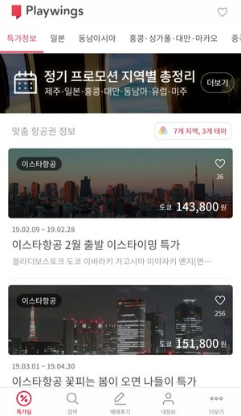
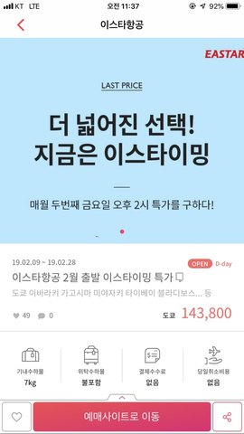
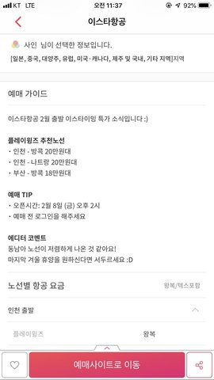

# Playwings Main List API





이 프로젝트의 목적은 Playwings 앱의 메인 리스트 및 딜 상세 기능을 구현하는 RESTFul API를 만드는 것 입니다. Playwings 앱을 사용해본 적이 없는 경우를 위해 간략히 설명하면, 여러개의 deal을 위 이미지와 같이 pager형태로 반환하고, 딜 상세페이지의 경우 단 하나의 딜 정보를 반환하는 것입니다.
데이터가 아주 정확할 필요 없으며, 위 데이터를 이용해 동일한 mock data를 만드셔서 작업하셔도 됩니다.

## Guidelines
* Playwings 앱을 잠시 사용해 보시는 것을 추천드립니다.
* Boilerplate, Starter Kit 등을 사용해서 프로젝트 시작하셔도 됩니다.
* 테스트코드가 필수로 포함되어있어야 합니다.
* 단위 작업 후에 최대한 Git Commit 하면서 작업해 주세요.
* 테스트 DB의 주소는 이메일로 전달드릴 예정입니다.

## Playiwng Main List 예시
```json
{
    "totalElements": 2125,
    "firstPage": false,
    "lastPage": false,
    "first": true,
    "last": false,
    "totalPages": 71,
    "numberOfElements": 30,
    "size": 30,
    "number": 0,
    "content": [
        {
            "id": 2296,
            "type": "NORMAL",
            "title": "이스타항공 2월 출발 이스타이밍 특가",
            "info": "왕복/택스포함",
            "url": "http://playwin.gs/1463",
            "imageUrl": "https://s3.ap-northeast-2.amazonaws.com/playwings-api-bucket/img/a4e95df6171805f9ac4fdebc983ab831.jpg",
            "likeCount": 38,
            "viewCount": 10823,
            "commentCount": 0,
            "company": {
                "id": 24,
                "name": "이스타항공",
                "color": "#e42626",
                "code": "ZE",
                "lastModified": 1436288040000,
                "companyPhoneNumber": "1544-0080"
            },
            "adCompany": {
                "id": 24,
                "name": "이스타항공",
                "color": "#e42626",
                "code": "ZE",
                "lastModified": 1436288040000,
                "companyPhoneNumber": "1544-0080"
            },
            "images": [
                {
                    "id": 666,
                    "name": "a4e95df6171805f9ac4fdebc983ab831.jpg",
                    "url": "https://s3.ap-northeast-2.amazonaws.com/playwings-api-bucket/img/a4e95df6171805f9ac4fdebc983ab831.jpg",
                    "ord": 0,
                    "lastModified": "2019-02-08T10:38:19",
                    "createdAt": "2019-02-08T10:38:19"
                }
            ],
            "startDate": "2019-02-08T10:20:28",
            "endDate": "2019-02-14T10:20:28",
            "arrivalDate": 1551324028000,
            "departureDate": 1549682428000,
            "mainPrice": 143800,
            "mainCityName": "도쿄",
            "locationImageUrl": "https://s3-ap-northeast-2.amazonaws.com/playwings-api-bucket/location_image/Japan_Tokyo_7.jpg",
            "cityNames": "블라디보스토크 방콕 하노이 나트랑 푸꾸옥 코타키나발루... 등",
            "tags": "이스타항공,",
            "dealOption": {
                "id": 20,
                "company": {
                    "id": 24,
                    "name": "이스타항공",
                    "color": "#e42626",
                    "code": "ZE",
                    "lastModified": 1436288040000,
                    "companyPhoneNumber": "1544-0080"
                },
                "cabinBaggage": "7kg",
                "referralBaggage": "불포함",
                "cancelFee": "없음",
                "theDayCancelFee": "없음",
                "template": true
            },
            "pcView": false,
            "closed": false,
            "status": 0,
            "weight": 55,
            "score": 50,
            "createdAt": "2019-02-08T10:38:19",
            "scheduledAt": "2019-02-08T10:20:28",
            "nightDeal": false,
            "top": false
        },
        {
            "id": 2295,
            "type": "NORMAL",
            "title": "이스타항공 꽃피는 봄이 오면 나들이 특가",
            "info": "왕복/택스포함",
            "url": "http://playwin.gs/1462",
            "imageUrl": "https://s3.ap-northeast-2.amazonaws.com/playwings-api-bucket/img/001cc89739ce876442661c74d33de8ca.jpg",
            "likeCount": 256,
            "viewCount": 848435,
            "commentCount": 11,
            "company": {
                "id": 24,
                "name": "이스타항공",
                "color": "#e42626",
                "code": "ZE",
                "lastModified": 1436288040000,
                "companyPhoneNumber": "1544-0080"
            },
            "adCompany": {
                "id": 24,
                "name": "이스타항공",
                "color": "#e42626",
                "code": "ZE",
                "lastModified": 1436288040000,
                "companyPhoneNumber": "1544-0080"
            },
            "images": [
                {
                    "id": 665,
                    "name": "001cc89739ce876442661c74d33de8ca.jpg",
                    "url": "https://s3.ap-northeast-2.amazonaws.com/playwings-api-bucket/img/001cc89739ce876442661c74d33de8ca.jpg",
                    "ord": 0,
                    "lastModified": "2019-02-07T10:50:26",
                    "createdAt": "2019-02-07T10:50:26"
                }
            ],
            "startDate": "2019-02-07T10:45:27",
            "endDate": "2019-02-13T10:45:27",
            "arrivalDate": 1556595927000,
            "departureDate": 1551411927000,
            "mainPrice": 151800,
            "mainCityName": "도쿄",
            "locationImageUrl": "https://s3-ap-northeast-2.amazonaws.com/playwings-api-bucket/location_image/Japan_Tokyo_4.jpg",
            "cityNames": "블라디보스토크 방콕 코타키나발루 다낭 나트랑 푸꾸옥 도쿄... 등",
            "tags": "이스타항공,",
            "dealOption": {
                "id": 20,
                "company": {
                    "id": 24,
                    "name": "이스타항공",
                    "color": "#e42626",
                    "code": "ZE",
                    "lastModified": 1436288040000,
                    "companyPhoneNumber": "1544-0080"
                },
                "cabinBaggage": "7kg",
                "referralBaggage": "불포함",
                "cancelFee": "없음",
                "theDayCancelFee": "없음",
                "template": true
            },
            "pcView": false,
            "closed": false,
            "status": 0,
            "weight": 55,
            "score": 50,
            "createdAt": "2019-02-07T10:50:25",
            "scheduledAt": "2019-02-07T10:45:27",
            "nightDeal": false,
            "top": false
        }

```

## Playiwng Deal Detail 예시
```json
{
    "id": 2260,
    "type": "NORMAL",
    "title": "에어부산 설 연휴 역귀성 특가",
    "documents": [
        {
            "id": 76352,
            "title": "예매 POINT!",
            "content": "에어부산 설 연휴 역귀성 소식입니다<br><br><strong>플레이윙즈 추천노선</strong><br><strong>·</strong> 부산 - 김포 8만원대<br><strong>·</strong> 대구 - 김포 8만원대<br><br><strong>예매 TIP</strong><br><strong>· </strong>오픈 시간: 1<strong>월 14일(월) 오전 11시</strong><br><strong>· </strong>프로모션 페이지 미오픈<br><br><strong>에디터 코멘트</strong><br>평소보다는 특가 운임이 비싸지만,<br>설 연휴임을 감안하면 괜찮은 편인 거 같습니다!<br>명절에 서울로 올라와야하는 분들은 놓치지마세요<br>",
            "lastModified": "2019-01-14T09:01:39",
            "createdAt": "2019-01-14T09:01:39",
            "ord": 0
        },
        {
            "id": 76353,
            "title": "예매 TIP!",
            "content": "",
            "lastModified": "2019-01-14T09:01:39",
            "createdAt": "2019-01-14T09:01:39",
            "ord": 1
        },
        {
            "id": 76354,
            "title": "자주있는 질문",
            "content": "※ 특가 예매 어떻게 하는거지?<br><a href=\"http://playwin.gs/Gb7GZR\" class=\"tx-link\">- 초보 사용자를 위한 특가 예매 방법</a><br><br><a href=\"http://playwin.gs/9CgTfN\" class=“tx-link\">- 찾고 있는 출발일의 특가가 없어요!</a><br><a href=\"http://playwin.gs/taHFOE\" class=\"tx-link\">- 찾고 있는 지역의 특가가 없어요!</a><br>",
            "lastModified": "2019-01-14T09:01:39",
            "createdAt": "2019-01-14T09:01:39",
            "ord": 10000
        }
    ],
    "info": "왕복/택스포함",
    "url": "http://playwin.gs/1426",
    "imageUrl": "https://s3.ap-northeast-2.amazonaws.com/playwings-api-bucket/img/bf4ac54f31b189f45cf5ac70a523b2eb.jpg",
    "likeCount": 147,
    "viewCount": 391364,
    "commentCount": 1,
    "company": {
        "id": 41,
        "name": "에어부산",
        "color": "#8ae4ff",
        "code": "BX",
        "lastModified": 1436288040000,
        "companyPhoneNumber": "1666-3060"
    },
    "adCompany": {
        "id": 41,
        "name": "에어부산",
        "color": "#8ae4ff",
        "code": "BX",
        "lastModified": 1436288040000,
        "companyPhoneNumber": "1666-3060"
    },
    "tickets": [
        {
            "id": 99411,
            "departure": {
                "id": 10,
                "countryName": "대한민국",
                "cityName": "대구",
                "airportName": "대구 국제공항",
                "airportCode": "TAE",
                "areaPopularOrd": 0,
                "areaPopular": false,
                "areaDangerous": false,
                "category": {
                    "id": 15,
                    "name": "제주 및 국내",
                    "description": "제주, 부산, 김포 등",
                    "imageUrl": "https://s3.ap-northeast-2.amazonaws.com/playwings-api-bucket/context/category/filter_5.jpg",
                    "code": "2001",
                    "usingOff": false
                },
                "areaThemes": []
            },
            "arrival": {
                "id": 7,
                "countryName": "대한민국",
                "cityName": "김포",
                "airportName": "김포 국제공항",
                "airportCode": "GMP",
                "areaPopularOrd": 0,
                "areaPopular": false,
                "areaDangerous": false,
                "category": {
                    "id": 15,
                    "name": "제주 및 국내",
                    "description": "제주, 부산, 김포 등",
                    "imageUrl": "https://s3.ap-northeast-2.amazonaws.com/playwings-api-bucket/context/category/filter_5.jpg",
                    "code": "2001",
                    "usingOff": false
                },
                "areaThemes": []
            },
            "dealId": 2260,
            "price": 84800,
            "ord": 0,
            "startDate": "2019-02-01T12:59:53",
            "endDate": "2019-02-10T12:59:53",
            "lastModified": "2019-01-14T09:01:39",
            "createdAt": "2019-01-14T09:01:39"
        },
        {
            "id": 99412,
            "departure": {
                "id": 8,
                "countryName": "대한민국",
                "cityName": "부산",
                "airportName": "김해 국제공항",
                "airportCode": "PUS",
                "areaPopularOrd": 0,
                "areaPopular": false,
                "areaDangerous": false,
                "category": {
                    "id": 15,
                    "name": "제주 및 국내",
                    "description": "제주, 부산, 김포 등",
                    "imageUrl": "https://s3.ap-northeast-2.amazonaws.com/playwings-api-bucket/context/category/filter_5.jpg",
                    "code": "2001",
                    "usingOff": false
                },
                "areaThemes": [
                    {
                        "id": 3,
                        "name": "휴양의 여유를 즐기는",
                        "description": "해변, 자연풍경, 섬, 액티비티",
                        "imageUrl": "https://s3.ap-northeast-2.amazonaws.com/playwings-api-bucket/context/theme/rest.jpg",
                        "code": "300",
                        "usingOff": false
                    },
                    {
                        "id": 4,
                        "name": "도시의 활기를 느끼는",
                        "description": "쇼핑, 야경, 랜드마크, 나이트라이프",
                        "imageUrl": "https://s3.ap-northeast-2.amazonaws.com/playwings-api-bucket/context/theme/city.jpg",
                        "code": "200",
                        "usingOff": false
                    },
                    {
                        "id": 1,
                        "name": "친구와 떠나는",
                        "description": "식도락, 볼거리, 액티비티, 저렴한물가",
                        "imageUrl": "https://s3.ap-northeast-2.amazonaws.com/playwings-api-bucket/context/theme/friend.jpg",
                        "code": "500",
                        "usingOff": false
                    },
                    {
                        "id": 2,
                        "name": "가족과 떠나는",
                        "description": "리조트, 관광, 자연풍경, 휴양",
                        "imageUrl": "https://s3.ap-northeast-2.amazonaws.com/playwings-api-bucket/context/theme/family.jpg",
                        "code": "400",
                        "usingOff": false
                    }
                ]
            },
            "arrival": {
                "id": 7,
                "countryName": "대한민국",
                "cityName": "김포",
                "airportName": "김포 국제공항",
                "airportCode": "GMP",
                "areaPopularOrd": 0,
                "areaPopular": false,
                "areaDangerous": false,
                "category": {
                    "id": 15,
                    "name": "제주 및 국내",
                    "description": "제주, 부산, 김포 등",
                    "imageUrl": "https://s3.ap-northeast-2.amazonaws.com/playwings-api-bucket/context/category/filter_5.jpg",
                    "code": "2001",
                    "usingOff": false
                },
                "areaThemes": []
            },
            "dealId": 2260,
            "price": 88800,
            "ord": 1,
            "startDate": "2019-02-01T12:59:53",
            "endDate": "2019-02-10T12:59:53",
            "lastModified": "2019-01-14T09:01:39",
            "createdAt": "2019-01-14T09:01:39"
        },
        {
            "id": 99413,
            "departure": {
                "id": 14,
                "countryName": "대한민국",
                "cityName": "울산",
                "airportName": "울산 공항",
                "airportCode": "USN",
                "areaPopularOrd": 0,
                "areaPopular": false,
                "areaDangerous": false,
                "category": {
                    "id": 15,
                    "name": "제주 및 국내",
                    "description": "제주, 부산, 김포 등",
                    "imageUrl": "https://s3.ap-northeast-2.amazonaws.com/playwings-api-bucket/context/category/filter_5.jpg",
                    "code": "2001",
                    "usingOff": false
                },
                "areaThemes": []
            },
            "arrival": {
                "id": 7,
                "countryName": "대한민국",
                "cityName": "김포",
                "airportName": "김포 국제공항",
                "airportCode": "GMP",
                "areaPopularOrd": 0,
                "areaPopular": false,
                "areaDangerous": false,
                "category": {
                    "id": 15,
                    "name": "제주 및 국내",
                    "description": "제주, 부산, 김포 등",
                    "imageUrl": "https://s3.ap-northeast-2.amazonaws.com/playwings-api-bucket/context/category/filter_5.jpg",
                    "code": "2001",
                    "usingOff": false
                },
                "areaThemes": []
            },
            "dealId": 2260,
            "price": 88800,
            "ord": 2,
            "startDate": "2019-02-01T12:59:53",
            "endDate": "2019-02-10T12:59:53",
            "lastModified": "2019-01-14T09:01:39",
            "createdAt": "2019-01-14T09:01:39"
        }
    ],
    "startDate": 1547441993000,
    "endDate": 1549774793000,
    "arrivalDate": 1549771193000,
    "departureDate": 1548993593000,
    "mainPrice": 84800,
    "mainCityName": "김포",
    "locationImageUrl": "https://s3.ap-northeast-2.amazonaws.com/playwings-api-bucket/location_image/default_1.jpg",
    "cityNames": "김포",
    "tags": "제주 및 국내,",
    "pcView": false,
    "closed": false,
    "status": 0,
    "weight": 50,
    "score": 50,
    "scheduledAt": 1547355593000,
    "nightDeal": false
}
```